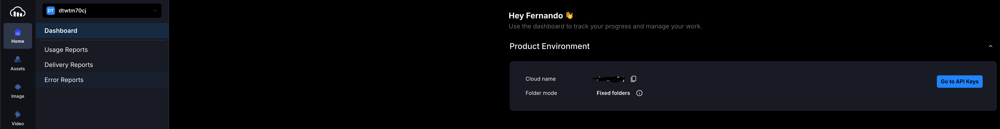
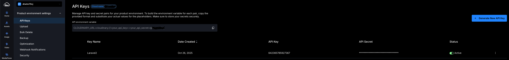

# Subida de archivos

# 📝 Subida de Archivos en Laravel 12

## 1️⃣ Conceptos básicos

En Laravel, podemos subir archivos a dos lugares principales:

1. **Local (disco público de Laravel)**
    - Se almacena en `storage/app/public`.
    - Para que sea accesible desde el navegador, necesitamos crear un enlace simbólico:

```bash
php artisan storage:link
```

1. 
    - Esto crea `public/storage` que apunta a `storage/app/public`.
2. **Cloud (Cloudinary)**
    - Servicio externo que aloja imágenes y otros archivos.
    - Permite URLs públicas accesibles desde cualquier lugar.
    - Integración moderna en Laravel 12 mediante **Storage Disk** (`cloudinary`).

---

## 2️⃣ Validación de archivos

Antes de guardar cualquier archivo, **siempre validar**:

```php
$messages = [
    'image.required' => 'Falta el archivo',
    'image.mimes' => 'Tipo no soportado',
    'image.max' => 'El archivo excede el tamaño máximo permitido',
];

$validator = Validator::make($request->all(), [
    'image' => 'required|image|mimes:jpeg,png,jpg,gif|max:2048', // 2MB
], $messages);

if ($validator->fails()) {
    return response()->json($validator->errors(), 422);
}
```

✅ Esto asegura:

- Solo imágenes válidas.
- Tamaño máximo respetado.
- Mensajes personalizados.

---

## 3️⃣ Subida de archivos **localmente**

```php
$file = $request->file('image');

// Generar nombre único
$filename = uniqid('img_') . $file->getClientOriginalName();

// Guardar en la carpeta 'perfiles' dentro del disco 'public'
$path = $file->storeAs('perfiles', $filename, 'public');

// URL accesible desde el navegador
$url = asset("storage/perfiles/$filename");

return response()->json(['path' => $path, 'url' => $url], 200);
```

### 🔑 Notas importantes

- `storeAs()` permite indicar el nombre exacto del archivo.
- `asset("storage/...")` genera la URL pública.
- El archivo queda en `storage/app/public/perfiles/`.

---

## 4️⃣ Subida de archivos a **Cloudinary**

### 4.0 Registro y configuración en Cloudinary

Después de registrarte, en el dashboard, encontrarás algo como esto, pulsa en ‘***Go to API Keys***’



En esta ventana podrás generar dos keys que te serán útiles más adelantes para configurar en tu proyecto Laravel.



### 4.1 Configuración Laravel

1. Instalar paquete oficial:

```bash
composer require cloudinary-labs/cloudinary-laravel
php artisan cloudinary:install 
```

1. Configurar los datos de acceso en `.env`

```bash
CLOUDINARY_KEY=tu_api_key
CLOUDINARY_SECRET=tu_api_secret
CLOUDINARY_CLOUD_NAME=tu_cloud_name
```

1. Configurar disco en `config/filesystems.php`:

```bash
'cloudinary' => [
    'driver' => 'cloudinary',
    'key' => env('CLOUDINARY_KEY'),
    'secret' => env('CLOUDINARY_SECRET'),
    'cloud' => env('CLOUDINARY_CLOUD_NAME'),
],
```

### 4.2 Subida segura y con nombre único:

```bash
$file = $request->file('image');

// Nombre y extensión separados
$originalName = pathinfo($file->getClientOriginalName(), PATHINFO_FILENAME);
$extension = $file->getClientOriginalExtension();

// Nombre único seguro
$filename = uniqid('img_') . '_' . Str::slug($originalName) . '.' . $extension;

// Subir usando disco Cloudinary
$uploadedFilePath = Storage::disk('cloudinary')->putFileAs('laravel', $file, $filename);

// Obtener URL pública
$url = Storage::disk('cloudinary')->url($uploadedFilePath);

return response()->json(['url' => $url], 200);
```

### 🔑 Notas importantes

- `Str::slug($originalName)` elimina caracteres problemáticos y espacios.
- Se mantiene la extensión para que Cloudinary identifique el tipo correctamente.
- `putFileAs()` permite especificar la carpeta (`laravel`) y el nombre exacto.
- La URL obtenida es pública y accesible desde cualquier navegador o app.

---

## 5️⃣ Comparativa Local vs Cloudinary

| Aspecto | Local (`public` disk) | Cloudinary (`cloudinary` disk) |
| --- | --- | --- |
| Ubicación | `storage/app/public` | Servidor de Cloudinary |
| URL pública | `asset('storage/...')` | `Storage::disk('cloudinary')->url(...)` |
| Nombres únicos | `uniqid() + originalName` | `uniqid() + Str::slug(originalName)` |
| Extensiones | Se conserva con `getClientOriginalName()` | Se conserva usando `getClientOriginalExtension()` |
| Acceso global | Solo local / servidor | Desde cualquier lugar con Internet |
| Enlace simbólico necesario | Sí (`php artisan storage:link`) | No necesario |

---

## 6️⃣ Buenas prácticas

1. **Validar siempre** los archivos antes de guardar.
2. **Generar nombres únicos** para evitar colisiones.
3. **Mantener la extensión** para evitar problemas de tipo de archivo.
4. **Manejo de errores** con try/catch para evitar fallos silenciosos.
5. **Separar la lógica** si quieres subir a diferentes discos (local y cloud).

---
